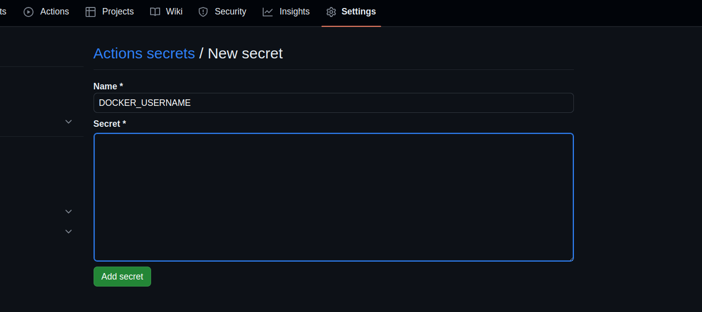

# How to deploy a node express server to AWS Elastic Beanstalk using docker and Github Actions

In this guide, we will explore the realms of containerization and automated deployment. I will take a simple node.js application and guide you through the process of dockerizing it and deploying it to an AWS Elastic Beanstalk using the power of GitHub Actions. Whether you are new to Docker or looking to streamline your deployment workflow, this guide has you covered.

## What is Docker?

On a high level, Docker is a tool that allows you to package an application and its dependencies into a single image. This image can run on any machine with Docker installed, regardless of the underlying operating system. Docker is a containerization platform, where containers are isolated environments containing everything an application needs to run. Think of Docker as a shipping container for your software application, holding all necessary components like code, libraries, and settings.

### Benefits of Docker:

- **Portability:** Docker images are portable and can run on any machine with Docker installed, simplifying deployment across different environments.
  
- **Reproducibility:** Docker ensures you can create the same environment for your application regardless of the machine it runs on, aiding in debugging and testing.

- **Scalability:** Docker allows horizontal scaling of applications by adding more machines to your cluster.

- **Security:** Docker can be used to create isolated environments, enhancing application security.

## Prerequisites
1. Github account
2. AWS account

## Steps to take
1. Set up project
2. Create dockerfile
3. Create docker-compose file
4. Add AWS IAM user credentials to github secrets
5. Write cicd pipeline

## Step 1: Set Up Project
Skip this step if you already have a project to deploy.

If you don't have a project, go to this [github-project](https://github.com/Pearlicia/simple-nodejs-server.git) url and download this simple node express application and push to your github

## Step 2: Create Dockerfile

Create a dockerfile in your project if you don't have already.
Here is a simple dockerfile

Dockerfile
```bash
FROM node

WORKDIR /app

COPY package.json ./

RUN npm install

COPY . .

EXPOSE 5000

CMD ["npm","run","start"]
```

## Step 3: Add Docker Hub Username and Password to Github Secrets

1. On your github account: Go to your project repository and click on `Settings`


2. On the left panel under `security` click on **`Secrets and variables`**


3. Under `Secrets and variables` click on **`Actions`**


4. Click on the green `New repository secret` button


5. On the `Name` field enter **`DOCKER_USERNAME`**
  - On the `Secret` field enter your docker hub username
  - Then click on the green `Add secret` button



6. Repeat step 4 and 5 but this time
  - On the `Name` field enter **`DOCKER_PASSWORD`**
  - On the `Secret` field enter your docker hub password
  - Then click on the green `Add secret` button

## Step 4: Create an EC2 Instance - Use ubuntu image - Install docker

Click this []() link and follow the steps to create an Ubuntu EC2 instance

Click this [Install-docker](./journal/install-docker-on-ec2.md) link and follow the steps to install Docker on your EC2 instance


## Step 5: Create a Self Hosted Runner
### Setting up Self-Hosted Runner on EC2:

Configure a self-hosted runner on AWS EC2 to enable GitHub Actions to run on your instance. The runner will facilitate tasks like pulling the Docker image and running the container.
 
Go to Github repo settings
- On `Code and automation` tab expand `Actions` and click on `Runners`
- Click on `new self hosted runner` button
- On `Runner image` select `Linux`
- On `Architecture` select `x64`
- Copy the `Download` and `Configure` code step by step and run on the EC2 instance

## Step 6: Write CICD Pipeline

### Workflow Overview:

#### Build Job:

1. **Checkout Source:** Fetch the source code.
2. **Login to Docker Hub:** Authenticate Docker login using GitHub Secrets for Docker username and password.
3. **Build Docker Image:** Build the Docker image for the Node.js application.
4. **Publish Image to Docker Hub:** Push the Docker image to Docker Hub for later use in deployment.

#### Deploy Job:

1. **Pull Image from Docker Hub:** Pull the Docker image from Docker Hub on the EC2 instance.
2. **Delete Old Container:** Remove any existing Docker container to avoid conflicts.
3. **Run Docker Container:** Start the Docker container on the EC2 instance.

If you get this error
```bash
permission denied while trying to connect to the Docker daemon socket at unix:///var/run/docker.sock: Post "http://%2Fvar%2Frun%2Fdocker.sock/v1.24/images/create?fromImage=pearlicia%2Fnodejs-app-cicd-docker-ec2&tag=latest": dial unix /var/run/docker.sock: connect: permission denied
Error: Process completed with exit code 1.
```

Run
```bash
sudo su
```
Then
```bash
chmod 777 /var/run/docker.sock
```

### Accessing the Application:

After deployment, access the Node.js application on the EC2 instance by updating security group inbound rules to allow traffic on port 5000.

## Conclusion:

Deploying a Node.js application on AWS EC2 using Docker and GitHub Actions streamlines the deployment process, making it more efficient and scalable. Docker's containerization benefits and GitHub Actions automation enhance the overall workflow.

